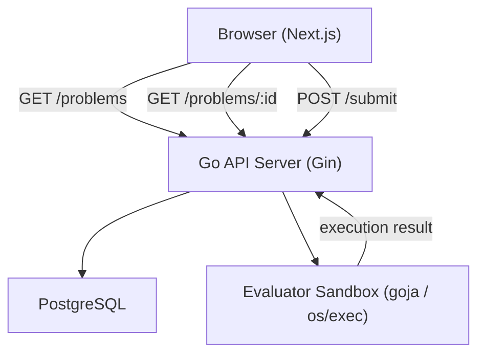
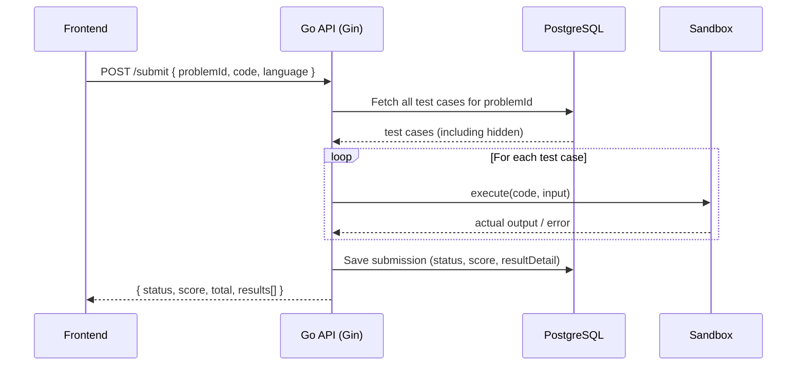

# Design Document — Balik Ngoding

## Overview

Balik Ngoding adalah web platform latihan logika pemrograman dasar yang ditujukan untuk fresh graduate dan developer yang ingin melatih kembali kemampuan problem solving secara mandiri. MVP mencakup lima fitur utama: daftar soal berdasarkan kategori, detail soal, code editor berbasis browser, submit jawaban, dan evaluasi hasil.

Platform ini dibangun dengan arsitektur client-server yang jelas:
- **Frontend**: Next.js 14 (App Router) + TailwindCSS + Monaco Editor
- **Backend**: Go (Golang) + Gin + GORM + PostgreSQL
- **Evaluator**: Sandboxed JavaScript execution menggunakan `goja` (Go JS runtime) atau `os/exec` subprocess

Tidak ada autentikasi di MVP. Semua fitur dapat diakses tanpa login.

---

## Architecture



### Request Flow — Submit Jawaban



---

## Components and Interfaces

### Frontend Components

| Komponen | Lokasi | Tanggung Jawab |
|----------|--------|----------------|
| `Navbar` | `components/Navbar.tsx` | Navigasi konsisten di semua halaman |
| `ProblemTable` | `components/ProblemList/ProblemTable.tsx` | Render tabel daftar soal |
| `CategoryFilter` | `components/ProblemList/CategoryFilter.tsx` | Filter tab kategori |
| `ProblemDescription` | `components/ProblemDetail/ProblemDescription.tsx` | Render deskripsi soal |
| `ExampleBlock` | `components/ProblemDetail/ExampleBlock.tsx` | Render contoh input/output |
| `CodeEditor` | `components/Editor/CodeEditor.tsx` | Monaco Editor wrapper |
| `SubmitButton` | `components/Editor/SubmitButton.tsx` | Tombol submit dengan loading state |
| `ResultPanel` | `components/Result/ResultPanel.tsx` | Panel hasil evaluasi |
| `TestCaseResult` | `components/Result/TestCaseResult.tsx` | Render per test case result |

### Backend Packages

| Package | Handler / Route | Service | Tanggung Jawab |
|---------|----------------|---------|----------------|
| `problems` | `GET /problems`, `GET /problems/:id` | `ProblemsService` | CRUD soal, filter aktif |
| `submissions` | `POST /submit` | `SubmissionsService` | Terima submission, simpan ke DB |
| `evaluator` | — | `EvaluatorService` | Eksekusi kode dalam sandbox |

### API Contracts

#### `GET /problems`
- Query params: `category?`, `difficulty?`
- Response: `{ data: Problem[] }` (hanya soal aktif, tanpa test cases)

#### `GET /problems/:id`
- Response: `{ data: ProblemDetail }` (dengan contoh test cases non-hidden)
- Error 404: soal tidak ditemukan

#### `POST /submit`
- Body: `{ problemId: string, code: string, language: string }`
- Response: `{ data: SubmissionResult }`
- Error 400: validasi gagal
- Error 404: problemId tidak valid

---

## Data Models

### Problem

```go
type Problem struct {
    ID          string     `json:"id" gorm:"type:uuid;primaryKey;default:gen_random_uuid()"`
    Title       string     `json:"title"`
    Description string     `json:"description"`
    Category    string     `json:"category"` // 'loop' | 'string' | 'array' | 'sql'
    Difficulty  string     `json:"difficulty"` // 'easy' | 'medium' | 'hard'
    StarterCode string     `json:"starterCode"`
    IsActive    bool       `json:"isActive" gorm:"default:true"`
    TestCases   []TestCase `json:"testCases,omitempty" gorm:"foreignKey:ProblemID"`
    CreatedAt   time.Time  `json:"createdAt"`
}
```

### TestCase

```go
type TestCase struct {
    ID             string `json:"id" gorm:"type:uuid;primaryKey;default:gen_random_uuid()"`
    ProblemID      string `json:"problemId" gorm:"type:uuid;not null"`
    Input          string `json:"input"`
    ExpectedOutput string `json:"expectedOutput"`
    IsHidden       bool   `json:"isHidden" gorm:"default:false"` // hidden test cases tidak ditampilkan ke user
}
```

### Submission

```go
type Submission struct {
    ID           string          `json:"id" gorm:"type:uuid;primaryKey;default:gen_random_uuid()"`
    ProblemID    string          `json:"problemId" gorm:"type:uuid;not null"`
    Code         string          `json:"code"`
    Language     string          `json:"language" gorm:"default:'javascript'"`
    Status       string          `json:"status"` // 'accepted' | 'wrong_answer' | 'error'
    Score        int             `json:"score"`
    Total        int             `json:"total"`
    ResultDetail json.RawMessage `json:"resultDetail" gorm:"type:jsonb"`
    CreatedAt    time.Time       `json:"createdAt"`
}
```

### TestCaseResult (response DTO)

```go
type TestCaseResult struct {
    Passed   bool   `json:"passed"`
    Input    string `json:"input"`
    Expected string `json:"expected"`
    Actual   string `json:"actual"`
    Error    string `json:"error,omitempty"` // hanya ada jika status === 'error'
}
```

### SubmissionResult (response DTO)

```go
type SubmissionResult struct {
    Status       string           `json:"status"` // 'accepted' | 'wrong_answer' | 'error'
    Score        int              `json:"score"`
    Total        int              `json:"total"`
    Results      []TestCaseResult `json:"results"`
    ErrorMessage string           `json:"errorMessage,omitempty"`
}
```

### Database Schema

```sql
CREATE TABLE problems (
  id UUID PRIMARY KEY DEFAULT gen_random_uuid(),
  title VARCHAR(255) NOT NULL,
  description TEXT NOT NULL,
  category VARCHAR(50) NOT NULL CHECK (category IN ('loop', 'string', 'array', 'sql')),
  difficulty VARCHAR(20) NOT NULL DEFAULT 'easy',
  starter_code TEXT NOT NULL,
  is_active BOOLEAN DEFAULT TRUE,
  created_at TIMESTAMP DEFAULT NOW()
);

CREATE TABLE test_cases (
  id UUID PRIMARY KEY DEFAULT gen_random_uuid(),
  problem_id UUID NOT NULL REFERENCES problems(id) ON DELETE CASCADE,
  input TEXT NOT NULL,
  expected_output TEXT NOT NULL,
  is_hidden BOOLEAN DEFAULT FALSE
);

CREATE TABLE submissions (
  id UUID PRIMARY KEY DEFAULT gen_random_uuid(),
  problem_id UUID NOT NULL,
  code TEXT NOT NULL,
  language VARCHAR(50) DEFAULT 'javascript',
  status VARCHAR(50) NOT NULL,
  score INT DEFAULT 0,
  total INT DEFAULT 0,
  result_detail JSONB,
  created_at TIMESTAMP DEFAULT NOW()
);

CREATE INDEX idx_test_cases_problem_id ON test_cases(problem_id);
CREATE INDEX idx_submissions_problem_id ON submissions(problem_id);
```

---

## Correctness Properties

### Property 1: Problem list only shows active problems

*For any* database state containing a mix of active and inactive problems, calling `GET /problems` should return only problems where `isActive = true`.

**Validates: Requirements 1.1, 7.3**

---

### Property 2: Category filter returns only matching problems

*For any* category value (`loop`, `string`, `array`, `sql`) and any set of problems, applying a category filter should return only problems whose category matches the filter value exactly.

**Validates: Requirements 1.2**

---

### Property 3: Problem list never exceeds 30 items

*For any* database state with more than 30 active problems, the `GET /problems` response should contain at most 30 items.

**Validates: Requirements 1.4**

---

### Property 4: Problem detail contains all required fields

*For any* problem stored in the database, the `GET /problems/:id` response should include title, description, category, difficulty, starterCode, and at least the non-hidden test cases as examples.

**Validates: Requirements 2.1, 7.1**

---

### Property 5: Editor initializes with starter code

*For any* problem with a non-empty `starterCode`, loading the problem detail page should result in the Code Editor containing exactly that starter code as its initial value.

**Validates: Requirements 2.2, 2.4**

---

### Property 6: Empty code submission is rejected

*For any* string composed entirely of whitespace characters (including the empty string), the submit button should be disabled and a validation message should be displayed, preventing the submission from being sent.

**Validates: Requirements 4.2**

---

### Property 7: Duplicate submit is idempotent

*For any* number of rapid submit button clicks while a submission is in-flight, exactly one HTTP request should be sent to `POST /submit`.

**Validates: Requirements 4.4**

---

### Property 8: Evaluation covers all test cases

*For any* submission, the number of results in the evaluation response should equal the total number of test cases (including hidden ones) associated with that problem.

**Validates: Requirements 5.1, 7.5**

---

### Property 9: Result panel contains required fields per test case

*For any* evaluation result, each test case entry in the result panel should display: passed/failed status, input, expected output, and actual output.

**Validates: Requirements 5.2**

---

### Property 10: Score display matches actual counts

*For any* evaluation result with `score` passed test cases out of `total`, the displayed score string should be in the format "X dari Y test case passed" where X = score and Y = total.

**Validates: Requirements 5.3**

---

### Property 11: Submission status is correctly determined

*For any* evaluation result:
- If all test cases passed → status is `accepted`
- If at least one test case failed and no runtime error → status is `wrong_answer`
- If a runtime or syntax error occurred → status is `error`

**Validates: Requirements 5.4, 5.5, 5.6**

---

### Property 12: Output normalization before comparison

*For any* actual output string with leading or trailing whitespace, the evaluator should trim it before comparing with the expected output, such that `"  Fizz  "` equals `"Fizz"`.

**Validates: Requirements 5.8**

---

### Property 13: Problem detail only exposes non-hidden test cases

*For any* problem with a mix of hidden and non-hidden test cases, the `GET /problems/:id` response should only include test cases where `isHidden = false` in the examples array.

**Validates: Requirements 7.4**

---

### Property 14: Submission is persisted with all required fields

*For any* completed submission, querying the database should return a record containing: problemId, code, language, status, score, total, and resultDetail.

**Validates: Requirements 7.6**

---

### Property 15: Sandbox blocks restricted resource access

*For any* code that attempts to access the file system (`fs`), network (`http`, `https`, `fetch`), or environment variables (`process.env`), the evaluator should block the access and return status `error`.

**Validates: Requirements 8.2**

---

### Property 16: "Coba Lagi" resets editor to starter code

*For any* problem, clicking the "Coba Lagi" button after a submission should reset the Code Editor content to the original `starterCode` of that problem.

**Validates: Requirements 6.2**

---

## Error Handling

| Skenario | Layer | Handling |
|----------|-------|----------|
| Backend tidak dapat diakses | Frontend | Tampilkan banner error informatif di Problem List |
| Soal tidak ditemukan (404) | Frontend | Redirect ke `/problems` dengan pesan error |
| Kode kosong saat submit | Frontend | Disable tombol submit + pesan validasi |
| Error jaringan saat submit | Frontend | Tampilkan pesan error di Result Panel, aktifkan kembali tombol submit |
| Runtime error dalam kode user | Evaluator | Status `error`, tampilkan pesan error deskriptif |
| Timeout eksekusi | Evaluator | Hentikan eksekusi, kembalikan status `error` + "Waktu eksekusi habis" |
| Akses resource terlarang | Evaluator | Blokir akses, kembalikan status `error` |
| Validasi DTO gagal | Backend | HTTP 400 dengan pesan validasi yang jelas |
| URL tidak valid | Frontend | Halaman 404 dengan tautan ke Problem List |

### Error Response Format (Backend)

```json
{
  "statusCode": 400,
  "message": "Deskripsi error yang jelas",
  "error": "Bad Request"
}
```

---

## Testing Strategy

### Dual Testing Approach

Testing menggunakan dua pendekatan yang saling melengkapi:

1. **Unit Tests** — Verifikasi contoh spesifik, edge cases, dan kondisi error
2. **Property-Based Tests** — Verifikasi properti universal di berbagai input yang di-generate secara acak

### Property-Based Testing

**Library yang digunakan:**
- Backend (Go): [`pgregory.net/rapid`](https://github.com/pgregory-net/rapid)
- Frontend (Next.js/TypeScript): [`fast-check`](https://github.com/dubzzz/fast-check)

**Konfigurasi:**
- Minimum **100 iterasi** per property test
- Setiap property test harus memiliki komentar referensi ke property di design document
- Format tag: `Feature: balik-ngoding, Property {N}: {property_text}`

**Contoh (Go backend):**
```go
// Feature: balik-ngoding, Property 2: Category filter returns only matching problems
func TestCategoryFilterProperty(t *testing.T) {
    rapid.Check(t, func(t *rapid.T) {
        problems := rapid.SliceOf(arbitraryProblem()).Draw(t, "problems")
        category := rapid.SampledFrom([]string{"loop", "string", "array", "sql"}).Draw(t, "category")
        result := filterByCategory(problems, category)
        for _, p := range result {
            if p.Category != category {
                t.Fatalf("expected category %s, got %s", category, p.Category)
            }
        }
    })
}
```

**Contoh (TypeScript frontend):**
```typescript
// Feature: balik-ngoding, Property 2: Category filter returns only matching problems
it('should return only problems matching the selected category', () => {
  fc.assert(
    fc.property(
      fc.array(arbitraryProblem()),
      fc.constantFrom('loop', 'string', 'array', 'sql'),
      (problems, category) => {
        const result = filterByCategory(problems, category);
        return result.every(p => p.category === category);
      }
    ),
    { numRuns: 100 }
  );
});
```

### Unit Testing

Unit tests fokus pada:
- Contoh spesifik yang mendemonstrasikan perilaku benar (happy path)
- Integration points antar komponen
- Edge cases dan kondisi error

**Hindari** menulis terlalu banyak unit test untuk kasus yang sudah dicakup property tests.

### Test Coverage per Layer

#### Backend (Go)

| Area | Tipe Test | Properties |
|------|-----------|------------|
| `ProblemsService.FindAll()` | Property | P1, P2, P3 |
| `ProblemsService.FindOne()` | Property | P4, P13 |
| `SubmissionsService.Submit()` | Property | P8, P11, P14 |
| `EvaluatorService.Evaluate()` | Property | P12, P15 |
| `EvaluatorService.Evaluate()` timeout | Example | Req 5.7, 8.3 |
| `POST /submit` validation | Property | P6 |
| Backend unavailable | Example | Req 1.3 |

#### Frontend (Next.js)

| Area | Tipe Test | Properties |
|------|-----------|------------|
| `filterByCategory()` | Property | P2 |
| `CodeEditor` initial value | Property | P5 |
| Submit button disabled on empty | Property | P6 |
| Duplicate submit prevention | Property | P7 |
| `ResultPanel` rendering | Property | P9, P10 |
| `ResultPanel` score format | Property | P10 |
| "Coba Lagi" reset | Property | P16 |
| Problem not found redirect | Example | Req 2.3 |
| 404 page | Example | Req 6.4 |
| Monaco fallback | Example | Req 3.4 |

### Seeding Data untuk Testing

Untuk integration tests, gunakan generator functions dengan `rapid`:

```go
func arbitraryProblem() *rapid.Generator[Problem] {
    return rapid.Custom(func(t *rapid.T) Problem {
        return Problem{
            ID:         rapid.StringMatching(`[0-9a-f-]{36}`).Draw(t, "id"),
            Title:      rapid.StringN(1, 100, -1).Draw(t, "title"),
            Category:   rapid.SampledFrom([]string{"loop", "string", "array", "sql"}).Draw(t, "category"),
            Difficulty: rapid.SampledFrom([]string{"easy", "medium", "hard"}).Draw(t, "difficulty"),
            StarterCode: rapid.StringN(1, 500, -1).Draw(t, "starterCode"),
            IsActive:   rapid.Bool().Draw(t, "isActive"),
        }
    })
}
```
