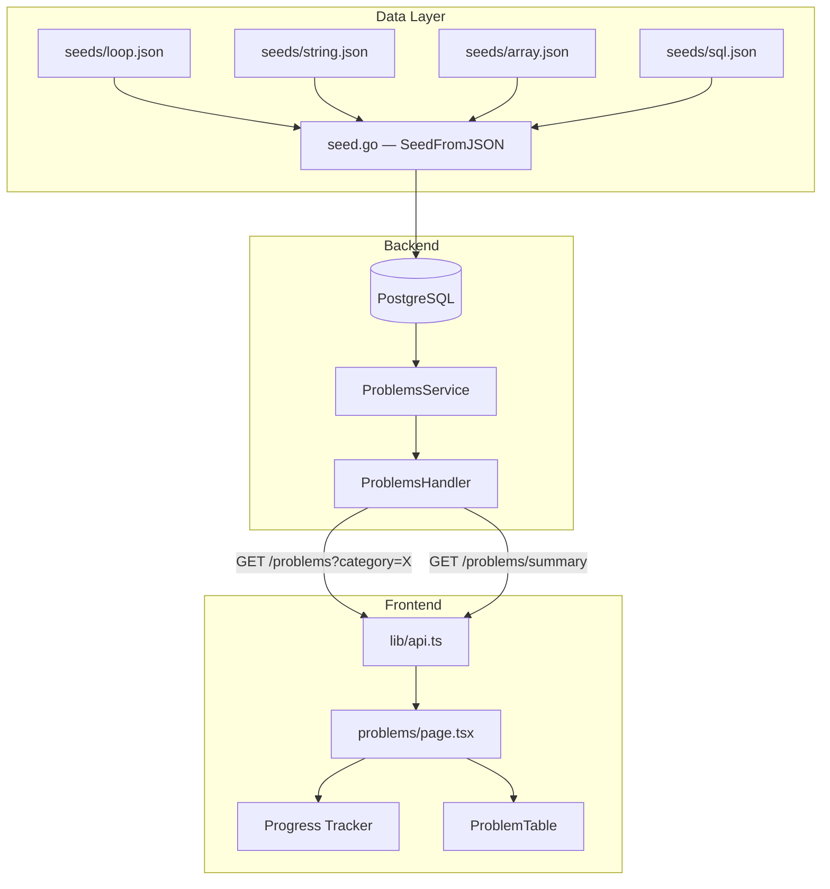

# Design Document — Learning Experience Overhaul

## Overview

Learning Experience Overhaul adalah refactor sistematis yang menyentuh tiga layer: **data layer** (migrasi seed monolitik ke JSON files), **API layer** (endpoint baru `/problems/summary` + ordering fix), dan **frontend layer** (kurangi API calls dari 5 ke 2). Tidak ada fitur baru dari nol — ini adalah perbaikan fondasi.

Perubahan utama:
- `seed.go` 2200+ baris → 4 JSON files per kategori + loader kecil
- `GET /problems/summary` baru untuk progress tracker
- `problems/page.tsx` dari 5 API calls → 2 API calls
- SQL ORDER BY dengan CASE expression untuk difficulty ordering

## Architecture



**Alur data saat halaman `/problems` dibuka:**
1. Frontend memanggil `GET /problems/summary` → dapat total soal per kategori → render Progress Tracker
2. Frontend memanggil `GET /problems?category=loop` → dapat daftar soal → render ProblemTable
3. Saat user ganti kategori → hanya panggil `GET /problems?category={new}` (summary tidak dipanggil ulang)

## Components and Interfaces

### Backend

#### `ProblemsService` — method baru

```go
// FindSummary mengembalikan jumlah soal aktif per kategori.
// Selalu mengembalikan entry untuk keempat kategori (loop, string, array, sql).
func (s *ProblemsService) FindSummary() ([]models.CategorySummary, error)

// FindAll — signature tidak berubah, tapi query ditambah ORDER BY
func (s *ProblemsService) FindAll(category, difficulty string) ([]models.Problem, error)
```

#### `ProblemsHandler` — handler baru

```go
// GetSummary handles GET /problems/summary
func (h *Handler) GetSummary(c *gin.Context)
```

#### Route registration di `main.go`

```go
r.GET("/problems/summary", problemsHandler.GetSummary)
r.GET("/problems", problemsHandler.GetProblems)
r.GET("/problems/:id", problemsHandler.GetProblemByID)
```

> Penting: `/problems/summary` harus didaftarkan **sebelum** `/problems/:id` agar Gin tidak menganggap `summary` sebagai `:id`.

#### `SeedFromJSON` — fungsi baru di `seed.go`

```go
// SeedFromJSON memuat soal dari embed.FS dan melakukan upsert ke database.
func SeedFromJSON(db *gorm.DB) error

// loadProblemsFromFile mem-parse satu JSON file dan memvalidasi strukturnya.
func loadProblemsFromFile(fs embed.FS, filename string) ([]models.Problem, error)
```

### Frontend

#### `lib/api.ts` — fungsi baru

```typescript
export async function getProblemsSummary(): Promise<CategorySummary[]>
```

#### `lib/types.ts` — type baru

```typescript
export interface CategorySummary {
  category: 'loop' | 'string' | 'array' | 'sql';
  total: number;
}
```

#### `problems/page.tsx` — state baru

```typescript
const [summary, setSummary] = useState<CategorySummary[]>([]);
```

Progress tracker dihitung dari `summary` (bukan `allProblems`):

```typescript
const totalCount = summary.reduce((acc, s) => acc + s.total, 0);
const completedCount = /* tetap dari useProgress().isAccepted */
```

## Data Models

### Go — `models.CategorySummary`

```go
// CategorySummary adalah response struct untuk GET /problems/summary.
// Tidak di-persist ke database — hanya digunakan sebagai DTO.
type CategorySummary struct {
    Category string `json:"category"`
    Total    int    `json:"total"`
}
```

### JSON Seed Format

Setiap file JSON (`loop.json`, `string.json`, `array.json`, `sql.json`) menggunakan format array of objects:

```json
[
  {
    "id": "00000000-0000-0000-0000-000000000001",
    "title": "For Loop Dasar",
    "category": "loop",
    "difficulty": "easy",
    "description": "...",
    "starterCode": "function jumlahSampaiN(n) {\n  ...\n}",
    "thinkingGuide": "...",
    "hints": [
      "Hint pertama: arah umum",
      "Hint kedua: persempit pendekatan",
      "Hint ketiga: hampir jawaban"
    ],
    "prerequisiteId": null,
    "testCases": [
      { "input": "5", "expectedOutput": "15", "isHidden": false },
      { "input": "3", "expectedOutput": "6",  "isHidden": false },
      { "input": "0", "expectedOutput": "0",  "isHidden": false },
      { "input": "1", "expectedOutput": "1",  "isHidden": true  },
      { "input": "10","expectedOutput": "55", "isHidden": true  }
    ]
  }
]
```

**Aturan validasi saat load:**
- Setiap soal wajib punya minimal 3 `testCases` dengan `isHidden: false`
- Setiap soal wajib punya minimal 2 `testCases` dengan `isHidden: true`
- Field `id`, `title`, `category`, `difficulty`, `description`, `starterCode` tidak boleh kosong
- `hints` harus array dengan tepat 3 elemen
- `thinkingGuide` tidak boleh null/kosong

**Struct Go untuk deserialisasi JSON:**

```go
// SeedProblem adalah representasi JSON dari satu soal di seed file.
// Berbeda dari models.Problem karena hints di JSON adalah []string biasa.
type SeedProblem struct {
    ID            string         `json:"id"`
    Title         string         `json:"title"`
    Category      string         `json:"category"`
    Difficulty    string         `json:"difficulty"`
    Description   string         `json:"description"`
    StarterCode   string         `json:"starterCode"`
    Schema        string         `json:"schema,omitempty"`
    ThinkingGuide *string        `json:"thinkingGuide"`
    Hints         []string       `json:"hints"`
    PrerequisiteID *string       `json:"prerequisiteId"`
    TestCases     []SeedTestCase `json:"testCases"`
}

type SeedTestCase struct {
    Input          string `json:"input"`
    ExpectedOutput string `json:"expectedOutput"`
    IsHidden       bool   `json:"isHidden"`
}
```

### embed.FS Setup

```go
//go:embed seeds/*.json
var seedFiles embed.FS

var seedFileNames = []string{
    "seeds/loop.json",
    "seeds/string.json",
    "seeds/array.json",
    "seeds/sql.json",
}
```

### Upsert Logic

GORM `Clauses(clause.OnConflict{...})` digunakan untuk upsert berdasarkan `id`:

```go
db.Clauses(clause.OnConflict{
    Columns:   []clause.Column{{Name: "id"}},
    DoUpdates: clause.AssignmentColumns([]string{
        "title", "description", "category", "difficulty",
        "starter_code", "schema", "thinking_guide", "hints",
        "prerequisite_id", "is_active",
    }),
}).Create(&problem)
```

TestCases di-upsert terpisah dengan `ON CONFLICT (problem_id, input)` — atau delete-then-insert per problem untuk simplisitas.

### SQL Query — `FindSummary`

```sql
SELECT category, COUNT(*) as total
FROM problems
WHERE is_active = true
GROUP BY category
```

Setelah query, hasil di-merge dengan daftar kategori tetap `["loop", "string", "array", "sql"]` untuk memastikan kategori dengan 0 soal tetap muncul:

```go
// Buat map dari hasil query
counts := map[string]int{}
for _, row := range rows {
    counts[row.Category] = row.Total
}

// Pastikan semua 4 kategori ada
categories := []string{"loop", "string", "array", "sql"}
result := make([]models.CategorySummary, len(categories))
for i, cat := range categories {
    result[i] = models.CategorySummary{Category: cat, Total: counts[cat]}
}
```

### SQL Query — `FindAll` dengan Ordering

```sql
SELECT * FROM problems
WHERE is_active = true
  AND (category = ? OR ? = '')
  AND (difficulty = ? OR ? = '')
ORDER BY
  CASE difficulty
    WHEN 'easy'   THEN 1
    WHEN 'medium' THEN 2
    WHEN 'hard'   THEN 3
    ELSE 4
  END,
  created_at ASC
```

Implementasi di GORM:

```go
query = query.Order(
    "CASE difficulty WHEN 'easy' THEN 1 WHEN 'medium' THEN 2 WHEN 'hard' THEN 3 ELSE 4 END, created_at ASC",
)
```

### Organisasi 80 Soal di JSON Files

Setiap file berisi 20 soal dengan distribusi difficulty:

| Soal | Difficulty |
|------|-----------|
| 1–7  | easy      |
| 8–14 | medium    |
| 15–20| hard      |

Prerequisite chain per kategori: soal ke-N memiliki `prerequisiteId` yang menunjuk ke soal ke-(N-1) dalam kategori yang sama. Soal pertama setiap kategori memiliki `prerequisiteId: null`.

```
loop-1 (easy, no prereq) → loop-2 (easy) → ... → loop-7 (easy) → loop-8 (medium) → ...
```

## Correctness Properties

*A property is a characteristic or behavior that should hold true across all valid executions of a system — essentially, a formal statement about what the system should do. Properties serve as the bridge between human-readable specifications and machine-verifiable correctness guarantees.*

### Property 1: Seed validation rejects problems with insufficient test cases

*For any* seed problem where the number of visible test cases is less than 3 or the number of hidden test cases is less than 2, `loadProblemsFromFile` should return a non-nil error containing the problem ID.

**Validates: Requirements 1.3**

---

### Property 2: Upsert idempotency

*For any* set of seed problems, running `SeedFromJSON` twice should produce the same database state as running it once — the total row count and all field values should be identical after both runs.

**Validates: Requirements 1.6**

---

### Property 3: Summary always returns all four categories with correct counts

*For any* database state (including empty or partial), `FindSummary` should return exactly 4 entries — one for each of `loop`, `string`, `array`, `sql` — where each `total` equals the actual count of active problems in that category.

**Validates: Requirements 3.2, 3.4**

---

### Property 4: Difficulty ordering is monotonically non-decreasing

*For any* category, the list returned by `FindAll(category, "")` should have difficulty values in non-decreasing order: all `easy` problems appear before all `medium`, which appear before all `hard`. Within the same difficulty, problems are ordered by `created_at` ascending.

**Validates: Requirements 2.3, 5.1, 5.2, 5.3**

---

### Property 5: Problems page makes exactly 2 API calls on initial load

*For any* initial render of `ProblemsPageInner` with any valid initial category, exactly 2 fetch calls should be made: one to `/problems/summary` and one to `/problems?category={selectedCategory}`. No additional calls to any other endpoint should occur.

**Validates: Requirements 4.1, 4.6**

---

### Property 6: Category switch makes exactly 1 additional API call

*For any* already-loaded `ProblemsPageInner`, switching to a different category should trigger exactly 1 additional fetch call to `/problems?category={newCategory}` and zero calls to `/problems/summary`.

**Validates: Requirements 4.3**

---

### Property 7: HintPanel visibility matches hints presence

*For any* problem, the HintPanel should be rendered if and only if `hints` is a non-null, non-empty array. When `hints` is null or `[]`, HintPanel must not appear in the rendered output.

**Validates: Requirements 6.1, 6.4**

---

### Property 8: ThinkingGuide visibility matches thinkingGuide presence

*For any* problem, the ThinkingGuide should be rendered if and only if `thinkingGuide` is a non-null, non-empty string. When `thinkingGuide` is null or `""`, ThinkingGuide must not appear in the rendered output.

**Validates: Requirements 6.2, 6.5**

---

### Property 9: Summary response contains only category and total fields

*For any* call to `GET /problems/summary`, each object in the returned `data` array should contain exactly the fields `category` and `total` — no problem content fields (title, description, starterCode, etc.) should be present.

**Validates: Requirements 3.6**

---

### Property 10: Seeded problems have exactly 3 hints and non-empty thinkingGuide

*For any* problem loaded from a seed JSON file, the `hints` array should contain exactly 3 non-empty strings and `thinkingGuide` should be a non-null, non-empty string.

**Validates: Requirements 2.4, 2.5, 6.3**

---

### Property 11: Prerequisite chain stays within the same category

*For any* problem that has a non-null `prerequisiteId`, the referenced prerequisite problem should exist in the same category and have a difficulty that is less than or equal to the current problem's difficulty.

**Validates: Requirements 2.6, 2.7**

---

### Property 12: Progress Tracker total is derived from summary data

*For any* `summary` state in `ProblemsPageInner`, the `totalCount` displayed in the Progress Tracker should equal the sum of all `total` values in the `summary` array.

**Validates: Requirements 4.2, 4.4**

---

## Error Handling

| Skenario | Layer | Penanganan |
|---|---|---|
| JSON file tidak bisa di-parse | Seed loader | Return error dengan nama file: `"failed to parse seeds/loop.json: ..."` |
| Soal tidak memenuhi validasi (test case kurang) | Seed loader | Return error dengan ID soal: `"problem 00000000-...-001: need at least 3 visible test cases"` |
| Database error di `FindSummary` | Handler | HTTP 500, body: `{"message": "Gagal mengambil ringkasan soal"}` |
| Database error di `FindAll` | Handler | HTTP 500, body: `{"message": "Gagal mengambil daftar soal"}` (sudah ada) |
| `GET /problems/summary` gagal di frontend | `problems/page.tsx` | `summary` tetap `[]`, Progress Tracker tampil 0/0, daftar soal tetap bisa dimuat |
| `GET /problems?category=X` gagal di frontend | `problems/page.tsx` | Error banner ditampilkan dengan tombol "Coba lagi" (sudah ada) |

## Testing Strategy

### Unit Tests (Vitest — Frontend)

Fokus pada contoh spesifik dan edge cases:

- `getProblemsSummary()` mengembalikan `CategorySummary[]` yang benar dari mock response
- Progress Tracker menampilkan `0/0` ketika `summary` kosong (fallback saat summary API gagal)
- `GET /problems/summary` gagal → daftar soal tetap tampil, Progress Tracker 0/0
- HintPanel tidak dirender ketika `hints` adalah `null`
- HintPanel tidak dirender ketika `hints` adalah `[]`
- ThinkingGuide tidak dirender ketika `thinkingGuide` adalah `null` atau `""`
- `GET /problems/summary` response tidak mengandung field `title`, `description`, `starterCode`

### Unit Tests (Go — Backend)

- `loadProblemsFromFile` mengembalikan error untuk JSON malformed
- `loadProblemsFromFile` mengembalikan error yang menyebut nama file ketika JSON tidak bisa di-parse
- `FindSummary` mengembalikan 4 entries meskipun database kosong
- `GetSummary` handler mengembalikan HTTP 500 ketika service error
- Seed JSON files berisi tepat 20 soal per kategori
- Distribusi difficulty per file: soal 1–7 easy, 8–14 medium, 15–20 hard

### Property-Based Tests (fast-check — Frontend)

Library: **fast-check** (sudah digunakan di project ini)

Setiap property test dijalankan minimum **100 iterasi**.

Tag format: `Feature: learning-experience-overhaul, Property {N}: {property_text}`

**Property 5 — API calls on initial load:**
```typescript
// Feature: learning-experience-overhaul, Property 5: Problems page makes exactly 2 API calls on initial load
fc.assert(fc.property(
  fc.constantFrom('loop', 'string', 'array', 'sql'),
  (initialCategory) => {
    // render ProblemsPageInner dengan mock fetch
    // assert fetch dipanggil tepat 2 kali
    // assert calls ke /problems/summary dan /problems?category={initialCategory}
  }
), { numRuns: 100 });
```

**Property 6 — Category switch:**
```typescript
// Feature: learning-experience-overhaul, Property 6: Category switch makes exactly 1 additional API call
fc.assert(fc.property(
  fc.constantFrom('loop', 'string', 'array', 'sql'),
  fc.constantFrom('loop', 'string', 'array', 'sql'),
  (initial, next) => {
    fc.pre(initial !== next);
    // render, tunggu initial load, ganti kategori
    // assert hanya 1 call tambahan, tidak ada call ke /summary
  }
), { numRuns: 100 });
```

**Property 7 — HintPanel visibility:**
```typescript
// Feature: learning-experience-overhaul, Property 7: HintPanel visibility matches hints presence
fc.assert(fc.property(
  fc.option(fc.array(fc.string(), { minLength: 1, maxLength: 5 })),
  (hints) => {
    // render problem detail dengan hints value
    // assert HintPanel rendered iff hints !== null && hints.length > 0
  }
), { numRuns: 100 });
```

**Property 8 — ThinkingGuide visibility:**
```typescript
// Feature: learning-experience-overhaul, Property 8: ThinkingGuide visibility matches thinkingGuide presence
fc.assert(fc.property(
  fc.option(fc.string()),
  (thinkingGuide) => {
    // render problem detail dengan thinkingGuide value
    // assert ThinkingGuide rendered iff thinkingGuide !== null && thinkingGuide !== ""
  }
), { numRuns: 100 });
```

**Property 12 — Progress Tracker total from summary:**
```typescript
// Feature: learning-experience-overhaul, Property 12: Progress Tracker total is derived from summary data
fc.assert(fc.property(
  fc.array(fc.record({
    category: fc.constantFrom('loop', 'string', 'array', 'sql'),
    total: fc.nat(50),
  }), { minLength: 0, maxLength: 4 }),
  (summary) => {
    // render dengan summary state
    // assert totalCount === summary.reduce((acc, s) => acc + s.total, 0)
  }
), { numRuns: 100 });
```

### Property-Based Tests (rapid — Go Backend)

Library: **pgregory.net/rapid** (sudah digunakan di project ini)

Setiap property test dijalankan minimum **100 iterasi** (default rapid).

**Property 1 — Seed validation:**
```go
// Feature: learning-experience-overhaul, Property 1: Seed validation rejects problems with insufficient test cases
rapid.Check(t, func(t *rapid.T) {
    visibleCount := rapid.IntRange(0, 2).Draw(t, "visibleCount")
    hiddenCount  := rapid.IntRange(0, 1).Draw(t, "hiddenCount")
    // buat SeedProblem dengan test cases sesuai count
    // assert loadProblemsFromFile returns non-nil error
    // assert error message mengandung problem ID
})
```

**Property 2 — Upsert idempotency:**
```go
// Feature: learning-experience-overhaul, Property 2: Upsert idempotency
rapid.Check(t, func(t *rapid.T) {
    problems := generateRandomSeedProblems(t)
    SeedFromJSON(db, problems) // run 1
    countAfterFirst := countProblems(db)
    SeedFromJSON(db, problems) // run 2
    countAfterSecond := countProblems(db)
    // assert countAfterFirst == countAfterSecond
    // assert semua field sama (tidak ada data yang berubah secara tidak sengaja)
})
```

**Property 3 — Summary always 4 categories:**
```go
// Feature: learning-experience-overhaul, Property 3: Summary always returns all four categories with correct counts
rapid.Check(t, func(t *rapid.T) {
    insertedCounts := insertRandomProblems(t, db)
    summary, err := service.FindSummary()
    // assert err == nil
    // assert len(summary) == 4
    // assert setiap kategori ada dan total-nya sesuai insertedCounts
})
```

**Property 4 — Difficulty ordering:**
```go
// Feature: learning-experience-overhaul, Property 4: Difficulty ordering is monotonically non-decreasing
rapid.Check(t, func(t *rapid.T) {
    category := rapid.SampledFrom([]string{"loop", "string", "array", "sql"}).Draw(t, "cat")
    // insert random problems dengan berbagai difficulty untuk kategori tersebut
    problems, _ := service.FindAll(category, "")
    diffOrder := map[string]int{"easy": 1, "medium": 2, "hard": 3}
    for i := 1; i < len(problems); i++ {
        // assert diffOrder[problems[i-1].Difficulty] <= diffOrder[problems[i].Difficulty]
    }
})
```

**Property 10 — Seeded problems have exactly 3 hints and non-empty thinkingGuide:**
```go
// Feature: learning-experience-overhaul, Property 10: Seeded problems have exactly 3 hints and non-empty thinkingGuide
rapid.Check(t, func(t *rapid.T) {
    // load semua problems dari seed JSON files
    // for each problem: assert len(hints) == 3
    // for each problem: assert thinkingGuide != nil && *thinkingGuide != ""
    // for each hint: assert hint != ""
})
```

**Property 11 — Prerequisite chain stays within same category:**
```go
// Feature: learning-experience-overhaul, Property 11: Prerequisite chain stays within the same category
rapid.Check(t, func(t *rapid.T) {
    // load semua problems dari seed JSON files
    // buat map id -> problem
    // for each problem dengan prerequisiteId != nil:
    //   assert prerequisite ada di map
    //   assert prerequisite.Category == problem.Category
    //   assert diffOrder[prerequisite.Difficulty] <= diffOrder[problem.Difficulty]
})
```
