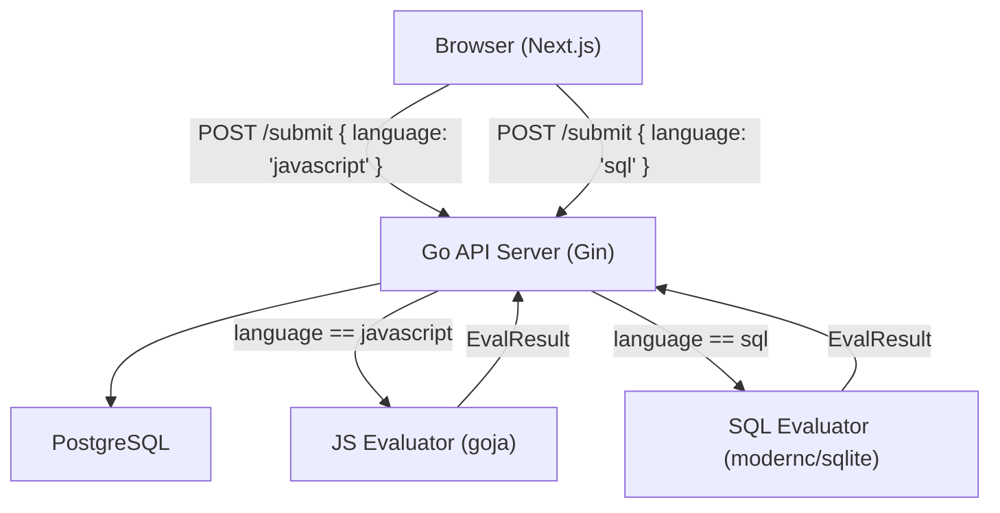
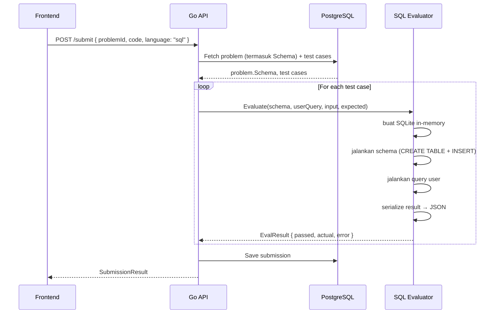

# Design Document — Tambah Soal

## Overview

Fitur ini memperluas platform Balik Ngoding dengan menambahkan 100 soal baru (loop, string, array, SQL) dan infrastruktur pendukungnya. Perubahan utama:

1. **SQL Evaluator** — evaluator baru berbasis SQLite in-memory (`modernc.org/sqlite`, pure Go)
2. **Schema field** — field `Schema` (TEXT nullable) di tabel `problems` untuk menyimpan DDL + seed data soal SQL
3. **EvaluatorService routing** — dispatch ke JS atau SQL evaluator berdasarkan `language`
4. **Seed data** — 100 soal baru di `seed.go` (25 loop, 25 string, 25 array, 25 SQL)
5. **Language selector** — frontend otomatis set language berdasarkan kategori soal

Tidak ada perubahan pada arsitektur utama. Backend tetap Go/Gin/GORM/PostgreSQL, frontend tetap Next.js.

---

## Architecture



### Request Flow — Submit SQL



---

## Components and Interfaces

### Komponen Baru / Dimodifikasi

| Komponen | Lokasi | Perubahan |
|----------|--------|-----------|
| `SQLEvaluatorService` | `backend/internal/evaluator/sql_evaluator.go` | Baru — evaluator SQL berbasis SQLite |
| `EvaluatorService` | `backend/internal/evaluator/evaluator.go` | Modifikasi — tambah routing method |
| `Problem` model | `backend/internal/models/models.go` | Tambah field `Schema string` |
| `SubmissionsService` | `backend/internal/submissions/service.go` | Modifikasi — pass language ke evaluator |
| `seed.go` | `backend/internal/database/seed.go` | Tambah 100 soal baru |
| `ProblemDetailPage` | `frontend/app/problems/[id]/page.tsx` | Tambah language selector otomatis |
| `SubmitButton` | `frontend/components/Editor/SubmitButton.tsx` | Terima prop `language` |
| `submissionStore` | `frontend/store/submissionStore.ts` | Tambah state `language` |

### Interface SQL Evaluator

```go
// SQLEvaluatorService mengeksekusi query SQL user terhadap SQLite in-memory.
type SQLEvaluatorService struct{}

func NewSQLEvaluatorService() *SQLEvaluatorService

// Evaluate menjalankan schema, lalu query user, lalu membandingkan hasil dengan expected.
// schema: DDL + INSERT statements untuk setup tabel
// query: query SQL dari user (hanya SELECT diizinkan)
// expected: JSON array of objects, e.g. `[{"name":"Alice","age":30}]`
func (s *SQLEvaluatorService) Evaluate(schema, query, expected string) EvalResult
```

### Interface EvaluatorService (dimodifikasi)

```go
// EvaluateWithLanguage mendispatch ke JS atau SQL evaluator berdasarkan language.
func (e *EvaluatorService) EvaluateWithLanguage(language, schema, code, input, expected string) EvalResult
```

### Frontend — Language Selector

Language ditentukan otomatis berdasarkan kategori soal:
- `loop`, `string`, `array` → `"javascript"`
- `sql` → `"sql"`

Tidak ada UI dropdown manual. Language selector hanya menampilkan badge read-only di editor top bar.

---

## Data Models

### Problem (dimodifikasi)

```go
type Problem struct {
    ID          string     `json:"id" gorm:"type:uuid;primaryKey;default:gen_random_uuid()"`
    Title       string     `json:"title"`
    Description string     `json:"description"`
    Category    string     `json:"category"`   // 'loop' | 'string' | 'array' | 'sql'
    Difficulty  string     `json:"difficulty"` // 'easy' | 'medium' | 'hard'
    StarterCode string     `json:"starterCode"`
    Schema      string     `json:"schema,omitempty" gorm:"type:text"` // SQL schema + seed data (nullable)
    IsActive    bool       `json:"isActive" gorm:"default:true"`
    TestCases   []TestCase `json:"testCases,omitempty" gorm:"foreignKey:ProblemID"`
    CreatedAt   time.Time  `json:"createdAt"`
}
```

### Database Migration

```sql
ALTER TABLE problems ADD COLUMN schema TEXT;
```

GORM AutoMigrate akan menangani ini secara otomatis saat startup.

### Struktur Soal SQL di Seed

```go
{
    Title:      "Nama Soal SQL",
    Category:   "sql",
    Difficulty: "easy",
    Description: `Deskripsi soal dalam Bahasa Indonesia.
    
Skema tabel:
  users(id INT, name TEXT, age INT)

Contoh data:
  (1, 'Alice', 30), (2, 'Bob', 25)

Contoh: SELECT name FROM users WHERE age > 28 → [{"name":"Alice"}]`,
    StarterCode: `SELECT -- tulis query kamu di sini
FROM users`,
    Schema: `CREATE TABLE users (id INTEGER, name TEXT, age INTEGER);
INSERT INTO users VALUES (1, 'Alice', 30);
INSERT INTO users VALUES (2, 'Bob', 25);`,
    IsActive: true,
    TestCases: []models.TestCase{
        {Input: "", ExpectedOutput: `[{"name":"Alice"}]`, IsHidden: false},
        {Input: "", ExpectedOutput: `[{"name":"Alice"},{"name":"Bob"}]`, IsHidden: true},
    },
}
```

> Catatan: untuk soal SQL, field `Input` di TestCase tidak digunakan (query user adalah "input"-nya). Field `Input` diisi string kosong `""`.

---

## SQL Evaluator — Detail Implementasi

### Dependency

```
modernc.org/sqlite v1.x  — pure Go SQLite, tidak butuh CGO
```

Tambahkan ke `go.mod`:
```
go get modernc.org/sqlite
```

### Flow Eksekusi

```
1. Validasi query: tolak jika mengandung kata kunci terlarang
2. Buka koneksi SQLite in-memory: "file::memory:?cache=shared"
3. Jalankan schema (CREATE TABLE + INSERT) dalam transaksi
4. Jalankan query user dengan context timeout 5 detik
5. Baca semua rows → serialize ke JSON array of objects
6. Bandingkan dengan expected output (JSON comparison, bukan string comparison)
7. Tutup koneksi
```

### Blocked Operations

Query user divalidasi sebelum eksekusi. Jika mengandung salah satu keyword berikut (case-insensitive), langsung return error:

```
DROP, DELETE, UPDATE, INSERT, CREATE, ALTER, TRUNCATE, ATTACH, DETACH
```

Validasi menggunakan regex sederhana pada query yang sudah di-trim:

```go
var blockedOps = regexp.MustCompile(
    `(?i)\b(DROP|DELETE|UPDATE|INSERT|CREATE|ALTER|TRUNCATE|ATTACH|DETACH)\b`,
)
```

### JSON Comparison

Expected output dan actual output dibandingkan setelah normalisasi JSON (unmarshal → marshal ulang) untuk menghindari perbedaan whitespace atau urutan key:

```go
func normalizeJSON(s string) (string, error) {
    var v interface{}
    if err := json.Unmarshal([]byte(s), &v); err != nil {
        return "", err
    }
    b, err := json.Marshal(v)
    return string(b), err
}
```

### Timeout

Menggunakan `context.WithTimeout(ctx, 5*time.Second)` saat menjalankan query.

---

## Seed Data — Struktur 100 Soal

### Distribusi

| Kategori | Jumlah | Easy | Medium | Hard |
|----------|--------|------|--------|------|
| loop     | 25     | 10   | 10     | 5    |
| string   | 25     | 10   | 10     | 5    |
| array    | 25     | 10   | 10     | 5    |
| sql      | 25     | 10   | 10     | 5    |
| **Total**| **100**| **40**| **40**| **20**|

### Contoh Soal per Kategori

#### Loop — Easy
```go
{
    Title: "Hitung Mundur",
    Category: "loop", Difficulty: "easy",
    Description: `Diberikan bilangan bulat N, kembalikan array berisi angka dari N turun ke 1.
Contoh: hitungMundur(5) → [5,4,3,2,1]`,
    StarterCode: "function hitungMundur(n) {\n  // Tulis kode kamu di sini\n}",
    TestCases: []models.TestCase{
        {Input: "5", ExpectedOutput: "[5,4,3,2,1]", IsHidden: false},
        {Input: "3", ExpectedOutput: "[3,2,1]", IsHidden: false},
        {Input: "1", ExpectedOutput: "[1]", IsHidden: false},
        {Input: "0", ExpectedOutput: "[]", IsHidden: true},
        {Input: "10", ExpectedOutput: "[10,9,8,7,6,5,4,3,2,1]", IsHidden: true},
    },
}
```

#### Loop — Hard
```go
{
    Title: "Spiral Matrix",
    Category: "loop", Difficulty: "hard",
    Description: `Diberikan bilangan bulat N, buat matrix N×N yang diisi angka 1 sampai N² secara spiral searah jarum jam.
Kembalikan matrix sebagai array 2D.
Contoh: spiralMatrix(3) → [[1,2,3],[8,9,4],[7,6,5]]`,
    StarterCode: "function spiralMatrix(n) {\n  // Tulis kode kamu di sini\n}",
    TestCases: []models.TestCase{
        {Input: "3", ExpectedOutput: "[[1,2,3],[8,9,4],[7,6,5]]", IsHidden: false},
        {Input: "1", ExpectedOutput: "[[1]]", IsHidden: false},
        {Input: "2", ExpectedOutput: "[[1,2],[4,3]]", IsHidden: false},
        {Input: "4", ExpectedOutput: "[[1,2,3,4],[12,13,14,5],[11,16,15,6],[10,9,8,7]]", IsHidden: true},
        {Input: "5", ExpectedOutput: "[[1,2,3,4,5],[16,17,18,19,6],[15,24,25,20,7],[14,23,22,21,8],[13,12,11,10,9]]", IsHidden: true},
        {Input: "6", ExpectedOutput: "[[1,2,3,4,5,6],[20,21,22,23,24,7],[19,32,33,34,25,8],[18,31,36,35,26,9],[17,30,29,28,27,10],[16,15,14,13,12,11]]", IsHidden: true},
    },
}
```

#### String — Easy
```go
{
    Title: "Hitung Vokal",
    Category: "string", Difficulty: "easy",
    Description: `Diberikan sebuah string, hitung jumlah huruf vokal (a, e, i, o, u) di dalamnya. Abaikan huruf besar/kecil.
Contoh: hitungVokal("halo dunia") → 5`,
    StarterCode: "function hitungVokal(s) {\n  // Tulis kode kamu di sini\n}",
    TestCases: []models.TestCase{
        {Input: `"halo dunia"`, ExpectedOutput: "5", IsHidden: false},
        {Input: `"AEIOU"`, ExpectedOutput: "5", IsHidden: false},
        {Input: `""`, ExpectedOutput: "0", IsHidden: false},
        {Input: `"bcdfg"`, ExpectedOutput: "0", IsHidden: true},
        {Input: `"programming"`, ExpectedOutput: "3", IsHidden: true},
    },
}
```

#### String — Hard
```go
{
    Title: "Kompresi String",
    Category: "string", Difficulty: "hard",
    Description: `Implementasikan kompresi string sederhana menggunakan run-length encoding.
Jika karakter berulang, ganti dengan karakter diikuti jumlah kemunculannya.
Jika hasil kompresi lebih panjang dari string asli, kembalikan string asli.
Contoh: kompresString("aabcccdddd") → "a2bc3d4"
Contoh: kompresString("abc") → "abc" (kompresi lebih panjang)`,
    StarterCode: "function kompresString(s) {\n  // Tulis kode kamu di sini\n}",
    TestCases: []models.TestCase{
        {Input: `"aabcccdddd"`, ExpectedOutput: `"a2bc3d4"`, IsHidden: false},
        {Input: `"abc"`, ExpectedOutput: `"abc"`, IsHidden: false},
        {Input: `""`, ExpectedOutput: `""`, IsHidden: false},
        {Input: `"aaa"`, ExpectedOutput: `"a3"`, IsHidden: true},
        {Input: `"aabbcc"`, ExpectedOutput: `"aabbcc"`, IsHidden: true},
        {Input: `"aaabbbccc"`, ExpectedOutput: `"a3b3c3"`, IsHidden: true},
    },
}
```

#### Array — Easy
```go
{
    Title: "Elemen Terbesar",
    Category: "array", Difficulty: "easy",
    Description: `Diberikan sebuah array bilangan bulat non-kosong, kembalikan nilai terbesar.
Contoh: elemenTerbesar([3,1,4,1,5,9,2,6]) → 9`,
    StarterCode: "function elemenTerbesar(arr) {\n  // Tulis kode kamu di sini\n}",
    TestCases: []models.TestCase{
        {Input: "[3,1,4,1,5,9,2,6]", ExpectedOutput: "9", IsHidden: false},
        {Input: "[1]", ExpectedOutput: "1", IsHidden: false},
        {Input: "[-1,-5,-3]", ExpectedOutput: "-1", IsHidden: false},
        {Input: "[0,0,0]", ExpectedOutput: "0", IsHidden: true},
        {Input: "[100,200,150]", ExpectedOutput: "200", IsHidden: true},
    },
}
```

#### Array — Hard
```go
{
    Title: "Subarray Terpanjang Tanpa Duplikat",
    Category: "array", Difficulty: "hard",
    Description: `Diberikan sebuah array bilangan bulat, temukan panjang subarray terpanjang yang tidak mengandung elemen duplikat.
Contoh: subarrayTerpanjang([1,2,3,1,2,3,4]) → 4 (subarray [1,2,3,4] atau [3,1,2,3,4] tidak valid, [2,3,1] tidak, [1,2,3,4] valid)
Contoh: subarrayTerpanjang([1,2,3,4]) → 4`,
    StarterCode: "function subarrayTerpanjang(arr) {\n  // Tulis kode kamu di sini\n}",
    TestCases: []models.TestCase{
        {Input: "[1,2,3,1,2,3,4]", ExpectedOutput: "4", IsHidden: false},
        {Input: "[1,2,3,4]", ExpectedOutput: "4", IsHidden: false},
        {Input: "[1,1,1,1]", ExpectedOutput: "1", IsHidden: false},
        {Input: "[]", ExpectedOutput: "0", IsHidden: true},
        {Input: "[1,2,1,3,2,3,4,5]", ExpectedOutput: "5", IsHidden: true},
        {Input: "[1]", ExpectedOutput: "1", IsHidden: true},
    },
}
```

#### SQL — Easy
```go
{
    Title: "Pilih Semua Pengguna",
    Category: "sql", Difficulty: "easy",
    Description: `Diberikan tabel users dengan kolom id, name, dan age, tulis query untuk mengambil semua data pengguna.

Skema tabel:
  users(id INT, name TEXT, age INT)

Contoh data: (1,'Alice',30), (2,'Bob',25), (3,'Charlie',35)
Expected: [{"id":1,"name":"Alice","age":30},{"id":2,"name":"Bob","age":25},{"id":3,"name":"Charlie","age":35}]`,
    StarterCode: "SELECT -- tulis query kamu di sini\nFROM users",
    Schema: `CREATE TABLE users (id INTEGER, name TEXT, age INTEGER);
INSERT INTO users VALUES (1, 'Alice', 30);
INSERT INTO users VALUES (2, 'Bob', 25);
INSERT INTO users VALUES (3, 'Charlie', 35);`,
    TestCases: []models.TestCase{
        {Input: "", ExpectedOutput: `[{"id":1,"name":"Alice","age":30},{"id":2,"name":"Bob","age":25},{"id":3,"name":"Charlie","age":35}]`, IsHidden: false},
        {Input: "", ExpectedOutput: `[{"id":1,"name":"Alice","age":30},{"id":2,"name":"Bob","age":25},{"id":3,"name":"Charlie","age":35}]`, IsHidden: true},
    },
}
```

#### SQL — Hard
```go
{
    Title: "Top 3 Departemen Bergaji Tertinggi",
    Category: "sql", Difficulty: "hard",
    Description: `Diberikan tabel employees(id, name, salary, department), tulis query untuk mendapatkan 3 departemen dengan rata-rata gaji tertinggi. Tampilkan department dan avg_salary (dibulatkan 2 desimal), diurutkan dari tertinggi.

Skema tabel:
  employees(id INT, name TEXT, salary REAL, department TEXT)`,
    StarterCode: "SELECT department, ROUND(AVG(salary), 2) AS avg_salary\nFROM employees\n-- lengkapi query kamu",
    Schema: `CREATE TABLE employees (id INTEGER, name TEXT, salary REAL, department TEXT);
INSERT INTO employees VALUES (1,'Alice',8000,'Engineering');
INSERT INTO employees VALUES (2,'Bob',6000,'Marketing');
INSERT INTO employees VALUES (3,'Charlie',9000,'Engineering');
INSERT INTO employees VALUES (4,'Diana',7000,'HR');
INSERT INTO employees VALUES (5,'Eve',5000,'Marketing');
INSERT INTO employees VALUES (6,'Frank',11000,'Engineering');
INSERT INTO employees VALUES (7,'Grace',8500,'HR');
INSERT INTO employees VALUES (8,'Hank',4500,'Support');`,
    TestCases: []models.TestCase{
        {Input: "", ExpectedOutput: `[{"department":"Engineering","avg_salary":9333.33},{"department":"HR","avg_salary":7750.0},{"department":"Marketing","avg_salary":5500.0}]`, IsHidden: false},
        {Input: "", ExpectedOutput: `[{"department":"Engineering","avg_salary":9333.33},{"department":"HR","avg_salary":7750.0},{"department":"Marketing","avg_salary":5500.0}]`, IsHidden: true},
    },
}
```

---

## Frontend — Language Selector

### Logika Otomatis

Di `ProblemDetailPage`, language ditentukan dari kategori soal:

```typescript
const language = problem.category === 'sql' ? 'sql' : 'javascript';
```

### Perubahan `submissionStore`

Tambah field `language` ke store:

```typescript
interface SubmissionStore {
  // ... existing fields
  language: string;
  setLanguage: (language: string) => void;
}
```

### Perubahan `SubmitButton`

Baca `language` dari store saat submit:

```typescript
const result = await submitSolution({ problemId, code, language });
```

### Perubahan Editor Top Bar

Tampilkan badge language read-only:

```tsx
<span className="text-xs text-gray-400 font-medium">
  {language === 'sql' ? 'solution.sql' : 'solution.js'}
</span>
```

### Perubahan `CodeEditor`

Untuk soal SQL, set Monaco language ke `"sql"` (syntax highlighting SQL):

```tsx
<Editor
  language={language === 'sql' ? 'sql' : 'javascript'}
  // ...
/>
```

---

## Correctness Properties

*A property is a characteristic or behavior that should hold true across all valid executions of a system — essentially, a formal statement about what the system should do. Properties serve as the bridge between human-readable specifications and machine-verifiable correctness guarantees.*

### Property 1: Semua soal JS memiliki field wajib yang valid

*For any* soal berkategori `loop`, `string`, atau `array` dalam seed data, soal tersebut harus memiliki: `Title` non-kosong, `Description` non-kosong, `StarterCode` yang mengandung deklarasi fungsi JavaScript, `Category` salah satu dari `loop/string/array`, `Difficulty` salah satu dari `easy/medium/hard`, dan `IsActive = true`.

**Validates: Requirements 1.3, 2.3, 3.3, 5.2, 7.1**

---

### Property 2: Semua soal SQL memiliki field Schema yang tidak kosong

*For any* soal berkategori `sql` dalam seed data, field `Schema` harus non-kosong dan mengandung minimal satu statement `CREATE TABLE`.

**Validates: Requirements 4.3**

---

### Property 3: Setiap soal memiliki jumlah test case minimum sesuai difficulty

*For any* soal dalam seed data:
- Soal `easy` dan `medium`: minimal 3 visible test case dan 2 hidden test case
- Soal `hard`: minimal 4 visible test case dan 3 hidden test case
- Soal `sql` (semua difficulty): minimal 2 visible test case dan 2 hidden test case

**Validates: Requirements 1.4, 2.4, 3.4, 4.4, 6.2**

---

### Property 4: Tidak ada dua soal dengan judul yang sama

*For any* dua soal berbeda dalam seed data, keduanya tidak boleh memiliki nilai `Title` yang identik (case-sensitive).

**Validates: Requirements 5.4**

---

### Property 5: Format expected output valid JSON

*For any* test case dalam seed data, field `ExpectedOutput` harus dapat di-parse sebagai JSON yang valid (menggunakan `json.Unmarshal`).

**Validates: Requirements 5.3, 7.5**

---

### Property 6: SQL Evaluator menolak operasi berbahaya

*For any* query SQL yang mengandung keyword `DROP`, `DELETE`, `UPDATE`, `INSERT`, `CREATE`, `ALTER`, `TRUNCATE`, `ATTACH`, atau `DETACH` (case-insensitive), SQL Evaluator harus mengembalikan `EvalResult` dengan `Passed = false` dan `Error` non-kosong tanpa mengeksekusi query tersebut.

**Validates: Requirements SQL.2**

---

### Property 7: SQL Evaluator menghasilkan output deterministik

*For any* schema SQL yang valid dan query SELECT yang valid, menjalankan evaluasi dua kali dengan input yang sama harus menghasilkan `EvalResult.Actual` yang identik.

**Validates: Requirements SQL.1, SQL.4**

---

### Property 8: EvaluatorService routing berdasarkan language

*For any* submission dengan `language = "sql"`, `EvaluatorService.EvaluateWithLanguage` harus menggunakan `SQLEvaluatorService`; untuk `language = "javascript"`, harus menggunakan `EvaluatorService` berbasis goja. Tidak boleh ada cross-routing.

**Validates: Requirements SQL.5**

---

### Property 9: StarterCode soal non-SQL mengandung deklarasi fungsi

*For any* soal berkategori `loop`, `string`, atau `array`, `StarterCode`-nya harus mengandung minimal satu deklarasi fungsi JavaScript yang dapat diekstrak oleh `extractFunctionName()` (regex `function\s+[a-zA-Z_$][a-zA-Z0-9_$]*`).

**Validates: Requirements 5.2, 7.1, 7.3**

---

## Error Handling

| Skenario | Layer | Handling |
|----------|-------|----------|
| Query SQL mengandung operasi terlarang | SQL Evaluator | Return `EvalResult{Passed: false, Error: "Operasi tidak diizinkan: hanya SELECT yang diperbolehkan"}` |
| Schema SQL tidak valid (syntax error) | SQL Evaluator | Return `EvalResult{Passed: false, Error: "Schema error: <detail>"}` |
| Query SQL timeout (>5 detik) | SQL Evaluator | Cancel context, return `EvalResult{Passed: false, Error: "Waktu eksekusi habis"}` |
| Query SQL menghasilkan output yang tidak bisa di-serialize ke JSON | SQL Evaluator | Return `EvalResult{Passed: false, Error: "Gagal serialize hasil query"}` |
| Expected output bukan JSON valid | SQL Evaluator | Return `EvalResult{Passed: false, Error: "Format expected output tidak valid"}` |
| Problem dengan category `sql` tidak memiliki Schema | SubmissionsService | Return error 500 dengan pesan "Schema soal SQL tidak ditemukan" |
| Language tidak dikenal di submission | EvaluatorService | Default ke JS evaluator, log warning |
| AutoMigrate gagal menambah kolom `schema` | Backend startup | Log fatal, exit |

---

## Testing Strategy

### Dual Testing Approach

1. **Unit tests** — contoh spesifik, edge cases, kondisi error
2. **Property-based tests** — properti universal di berbagai input yang di-generate secara acak

### Library

- Backend (Go): `pgregory.net/rapid` (sudah ada di `go.mod`)
- Frontend (TypeScript): `fast-check` (sudah ada di project)

### Konfigurasi

- Minimum **100 iterasi** per property test
- Setiap property test harus memiliki komentar referensi ke property di design document
- Format tag: `Feature: tambah-soal, Property {N}: {property_text}`

### Backend Property Tests

```go
// Feature: tambah-soal, Property 6: SQL Evaluator menolak operasi berbahaya
func TestSQLEvaluatorBlocksDangerousOps(t *testing.T) {
    svc := NewSQLEvaluatorService()
    dangerousOps := []string{"DROP", "DELETE", "UPDATE", "INSERT", "CREATE", "ALTER", "TRUNCATE"}
    rapid.Check(t, func(t *rapid.T) {
        op := rapid.SampledFrom(dangerousOps).Draw(t, "op")
        query := op + " TABLE users"
        result := svc.Evaluate("CREATE TABLE users (id INTEGER);", query, "[]")
        if result.Passed {
            t.Fatalf("expected blocked op %s to fail, but passed", op)
        }
        if result.Error == "" {
            t.Fatalf("expected error message for blocked op %s", op)
        }
    })
}

// Feature: tambah-soal, Property 7: SQL Evaluator menghasilkan output deterministik
func TestSQLEvaluatorDeterministic(t *testing.T) {
    svc := NewSQLEvaluatorService()
    schema := `CREATE TABLE t (id INTEGER, val TEXT);
INSERT INTO t VALUES (1, 'a');
INSERT INTO t VALUES (2, 'b');`
    rapid.Check(t, func(t *rapid.T) {
        query := "SELECT * FROM t ORDER BY id"
        r1 := svc.Evaluate(schema, query, `[{"id":1,"val":"a"},{"id":2,"val":"b"}]`)
        r2 := svc.Evaluate(schema, query, `[{"id":1,"val":"a"},{"id":2,"val":"b"}]`)
        if r1.Actual != r2.Actual {
            t.Fatalf("non-deterministic: %q vs %q", r1.Actual, r2.Actual)
        }
    })
}

// Feature: tambah-soal, Property 4: Tidak ada dua soal dengan judul yang sama
func TestSeedNoDuplicateTitles(t *testing.T) {
    problems := getAllSeedProblems() // helper yang return slice soal dari seed
    titles := make(map[string]bool)
    for _, p := range problems {
        if titles[p.Title] {
            t.Fatalf("duplicate title found: %q", p.Title)
        }
        titles[p.Title] = true
    }
}

// Feature: tambah-soal, Property 5: Format expected output valid JSON
func TestSeedExpectedOutputValidJSON(t *testing.T) {
    problems := getAllSeedProblems()
    for _, p := range problems {
        for _, tc := range p.TestCases {
            var v interface{}
            if err := json.Unmarshal([]byte(tc.ExpectedOutput), &v); err != nil {
                t.Fatalf("problem %q test case has invalid JSON expected output %q: %v",
                    p.Title, tc.ExpectedOutput, err)
            }
        }
    }
}
```

### Backend Unit Tests

```go
// SQL Evaluator — happy path
func TestSQLEvaluatorSelectAll(t *testing.T) {
    svc := NewSQLEvaluatorService()
    schema := `CREATE TABLE users (id INTEGER, name TEXT);
INSERT INTO users VALUES (1, 'Alice');`
    result := svc.Evaluate(schema, "SELECT * FROM users", `[{"id":1,"name":"Alice"}]`)
    assert.True(t, result.Passed)
    assert.Empty(t, result.Error)
}

// SQL Evaluator — timeout
func TestSQLEvaluatorTimeout(t *testing.T) {
    svc := NewSQLEvaluatorService()
    // Query yang sangat lambat (recursive CTE tanpa batas)
    result := svc.Evaluate("", "WITH RECURSIVE r(n) AS (SELECT 1 UNION ALL SELECT n+1 FROM r) SELECT * FROM r", "[]")
    assert.False(t, result.Passed)
    assert.Contains(t, result.Error, "Waktu eksekusi habis")
}

// EvaluatorService routing
func TestEvaluatorRoutingSQL(t *testing.T) {
    svc := NewEvaluatorService()
    schema := `CREATE TABLE t (x INTEGER); INSERT INTO t VALUES (42);`
    result := svc.EvaluateWithLanguage("sql", schema, "SELECT x FROM t", "", `[{"x":42}]`)
    assert.True(t, result.Passed)
}
```

### Frontend Unit Tests

```typescript
// Feature: tambah-soal — language selector otomatis
it('sets language to sql for sql category', () => {
  const problem = { category: 'sql', /* ... */ } as Problem;
  const language = problem.category === 'sql' ? 'sql' : 'javascript';
  expect(language).toBe('sql');
});

it('sets language to javascript for loop/string/array categories', () => {
  fc.assert(
    fc.property(
      fc.constantFrom('loop', 'string', 'array'),
      (category) => {
        const language = category === 'sql' ? 'sql' : 'javascript';
        return language === 'javascript';
      }
    ),
    { numRuns: 100 }
  );
});
```

### Test Coverage per Layer

| Area | Tipe Test | Properties |
|------|-----------|------------|
| `SQLEvaluatorService.Evaluate()` — blocked ops | Property | P6 |
| `SQLEvaluatorService.Evaluate()` — deterministic | Property | P7 |
| `SQLEvaluatorService.Evaluate()` — timeout | Example | Error Handling |
| `SQLEvaluatorService.Evaluate()` — happy path | Example | P7 |
| `EvaluatorService.EvaluateWithLanguage()` routing | Property | P8 |
| Seed data — no duplicate titles | Example | P4 |
| Seed data — valid JSON expected output | Example | P5 |
| Seed data — JS soal field validation | Example | P1 |
| Seed data — SQL soal schema non-empty | Example | P2 |
| Seed data — test case count per difficulty | Example | P3 |
| Frontend language selector | Example | — |
