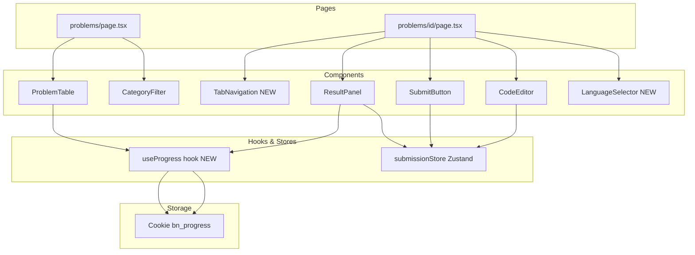

# Design Document: User Experience Improvements

## Overview

Dokumen ini mendeskripsikan desain teknis untuk lima peningkatan UX pada aplikasi **Balik Ngoding** — sebuah platform coding challenge berbasis Next.js 14 + TypeScript + Tailwind CSS dengan backend Go + Gin.

Kelima fitur bersifat independen satu sama lain dan dapat diimplementasikan secara paralel, namun semuanya berinteraksi dengan komponen inti yang sama: `CodeEditor`, `SubmitButton`, `ProblemTable`, `ResultPanel`, dan halaman `problems/[id]/page.tsx`.

Tujuan utama:
- Meningkatkan discoverability bahasa yang tersedia (Language Coming Soon)
- Mempercepat alur submit tanpa mouse (Ctrl+Enter)
- Memberikan feedback progress tanpa login (Cookie-based Progress)
- Mengurangi payload awal halaman soal (Category-based Fetching)
- Membuat halaman detail soal nyaman di mobile (Mobile-Friendly Layout)

---

## Architecture

### Gambaran Komponen yang Terlibat



### Prinsip Desain

1. **Minimal surface area** — setiap fitur hanya menyentuh file yang diperlukan, tidak ada refactor besar-besaran.
2. **Cookie sebagai sumber kebenaran progress** — tidak ada server-side state untuk progress, cukup `document.cookie`.
3. **Server-driven filtering** — filter kategori dilakukan di backend, bukan di client.
4. **Responsive-first** — layout mobile menggunakan Tailwind breakpoint `md:` tanpa library tambahan.

---

## Components and Interfaces

### 1. LanguageSelector (Baru)

Komponen baru di `frontend/components/Editor/LanguageSelector.tsx`.

```typescript
interface Language {
  value: string;
  label: string;
  active: boolean; // true = dapat dipilih, false = coming soon
}

interface LanguageSelectorProps {
  selected: string;       // bahasa yang sedang aktif
  onChange: (lang: string) => void;
  problemCategory: string; // untuk menentukan default otomatis
}
```

Daftar bahasa yang ditampilkan (hardcoded):
```typescript
const LANGUAGES: Language[] = [
  { value: 'javascript', label: 'JavaScript', active: true },
  { value: 'sql',        label: 'SQL',        active: true },
  { value: 'python',     label: 'Python',     active: false },
  { value: 'java',       label: 'Java',       active: false },
  { value: 'php',        label: 'PHP',        active: false },
  { value: 'c',          label: 'C',          active: false },
];
```

Logika pemilihan bahasa default:
- Jika `problemCategory === 'sql'` → default `'sql'`
- Selain itu → default `'javascript'`

Bahasa dengan `active: false` dirender dengan badge "Coming Soon" dan `disabled` / `pointer-events-none`.

---

### 2. CodeEditor — Tambahan onSubmit & onMount

Perubahan pada `frontend/components/Editor/CodeEditor.tsx`:

```typescript
interface CodeEditorProps {
  value: string;
  onChange: (value: string) => void;
  language?: string;
  onSubmit?: () => void; // BARU: callback untuk Ctrl+Enter
}
```

Pada `onMount`, daftarkan Monaco action:
```typescript
editor.addAction({
  id: 'submit-solution',
  label: 'Submit Solution',
  keybindings: [monaco.KeyMod.CtrlCmd | monaco.KeyCode.Enter],
  run: () => { onSubmit?.(); },
});
```

`KeyMod.CtrlCmd` otomatis memetakan ke `Ctrl` di Windows/Linux dan `Cmd` di macOS.

Cleanup: Monaco action otomatis di-dispose saat editor di-unmount karena terikat pada instance editor.

---

### 3. useProgress Hook (Baru)

Custom hook di `frontend/hooks/useProgress.ts`:

```typescript
type ProgressMap = Record<string, 'accepted'>;

interface UseProgressReturn {
  progress: ProgressMap;
  markAccepted: (problemId: string) => void;
  isAccepted: (problemId: string) => boolean;
}

function useProgress(): UseProgressReturn
```

Implementasi:
- Baca cookie `bn_progress` saat inisialisasi, parse JSON, fallback ke `{}` jika gagal.
- `markAccepted` hanya menulis jika status belum `'accepted'` (tidak menimpa yang sudah ada).
- Tulis ke cookie dengan `max-age=31536000` (365 hari).
- State disimpan di `useState` lokal agar reaktif.

---

### 4. problems/page.tsx — Category-based Fetching

Perubahan pada `useEffect`:

```typescript
// Sebelum: fetch semua, filter di client
useEffect(() => { fetchProblems(); }, []);
const filtered = problems.filter(p => p.category === selectedCategory);

// Sesudah: fetch per kategori, tidak ada filter client-side
useEffect(() => {
  fetchProblems(selectedCategory);
}, [selectedCategory]);
```

Fungsi `fetchProblems` menerima `category` sebagai parameter dan memanggil `getProblems(category)`.

---

### 5. Mobile Tab Navigation

Perubahan pada `frontend/app/problems/[id]/page.tsx`:

```typescript
type ActiveTab = 'soal' | 'editor';
const [activeTab, setActiveTab] = useState<ActiveTab>('soal');
```

Layout menggunakan Tailwind responsive classes:
- `md:flex` untuk desktop side-by-side
- `flex flex-col md:hidden` untuk tab navigation di mobile
- `hidden md:block` / `hidden md:flex` untuk menyembunyikan/menampilkan panel berdasarkan viewport

---

## Data Models

### Cookie: `bn_progress`

Format JSON yang disimpan di cookie:

```typescript
// Tipe
type ProgressMap = Record<string, 'accepted'>;

// Contoh nilai
{
  "problem-uuid-1": "accepted",
  "problem-uuid-2": "accepted"
}
```

Properti cookie:
- **Name**: `bn_progress`
- **Max-Age**: `31536000` (365 hari dalam detik)
- **Path**: `/`
- **SameSite**: `Lax`

Alasan hanya menyimpan `'accepted'`: status lain (wrong_answer, error) tidak perlu dipersist karena tidak memberikan informasi progress yang bermakna bagi user.

### Perubahan pada SubmissionStore

Tidak ada perubahan pada interface `SubmissionStore`. Hook `useProgress` berdiri sendiri dan dipanggil dari `ResultPanel` saat `result.status === 'accepted'`.

### Perubahan pada Problem type

Tidak ada perubahan pada tipe `Problem` di `lib/types.ts`.

---

## Correctness Properties


*A property is a characteristic or behavior that should hold true across all valid executions of a system — essentially, a formal statement about what the system should do. Properties serve as the bridge between human-readable specifications and machine-verifiable correctness guarantees.*

### Property 1: Language list completeness

*For any* instance of LanguageSelector yang dirender, daftar bahasa yang ditampilkan SHALL selalu mengandung tepat enam bahasa: JavaScript, SQL, Python, Java, PHP, dan C.

**Validates: Requirements 1.1**

---

### Property 2: Active languages are selectable

*For any* instance LanguageSelector, JavaScript dan SQL SHALL selalu dirender tanpa atribut `disabled` dan tanpa label "Coming Soon", sehingga dapat diklik oleh user.

**Validates: Requirements 1.2**

---

### Property 3: Coming soon languages are disabled and labeled

*For any* instance LanguageSelector, bahasa Python, Java, PHP, dan C SHALL selalu dirender dengan label "Coming Soon" dan dalam kondisi disabled (tidak dapat diklik), sehingga bahasa aktif tidak berubah jika user mencoba mengklik salah satunya.

**Validates: Requirements 1.3, 1.4, 1.6**

---

### Property 4: Default language matches problem category

*For any* nilai `problemCategory`, fungsi yang menentukan bahasa default SHALL mengembalikan `'sql'` jika dan hanya jika `problemCategory === 'sql'`, dan mengembalikan `'javascript'` untuk semua kategori lainnya.

**Validates: Requirements 1.5**

---

### Property 5: Ctrl+Enter triggers submit callback

*For any* CodeEditor yang dirender dengan prop `onSubmit`, menekan Ctrl+Enter pada editor SHALL memanggil `onSubmit` tepat satu kali, identik dengan menekan tombol "Submit Jawaban".

**Validates: Requirements 2.1**

---

### Property 6: Ctrl+Enter ignored when loading

*For any* CodeEditor dengan `isLoading === true` di submissionStore, menekan Ctrl+Enter SHALL tidak memanggil `onSubmit` (submission diabaikan selama proses berlangsung).

**Validates: Requirements 2.2**

---

### Property 7: Ctrl+Enter ignored for whitespace-only code

*For any* string yang terdiri seluruhnya dari karakter whitespace (spasi, tab, newline), menekan Ctrl+Enter dengan kode tersebut di editor SHALL tidak memanggil `onSubmit` dan tidak memproses submission.

**Validates: Requirements 2.3**

---

### Property 8: markAccepted round-trip

*For any* `problemId` yang valid, memanggil `markAccepted(problemId)` SHALL menghasilkan cookie `bn_progress` yang dapat di-parse sebagai JSON valid dan mengandung `problemId` dengan nilai `'accepted'`.

**Validates: Requirements 3.1, 3.2**

---

### Property 9: Accepted status is preserved (non-downgradeable)

*For any* `problemId` yang sudah memiliki status `'accepted'` di progress store, memanggil operasi apapun yang bukan `markAccepted` (termasuk submission dengan status `wrong_answer` atau `error`) SHALL tidak mengubah status tersebut menjadi selain `'accepted'`.

**Validates: Requirements 3.8**

---

### Property 10: Invalid cookie graceful fallback

*For any* string yang bukan JSON valid (termasuk string kosong, corrupt, atau non-JSON) yang tersimpan sebagai nilai cookie `bn_progress`, inisialisasi `useProgress` SHALL mengembalikan `progress` sebagai objek kosong `{}` tanpa melempar error atau exception.

**Validates: Requirements 3.7**

---

### Property 11: Accepted problems show visual indicator in table

*For any* daftar soal yang dirender oleh ProblemTable, setiap soal yang `problemId`-nya ada di progress store dengan status `'accepted'` SHALL menampilkan indikator visual (ikon ✓ atau badge "Selesai" berwarna hijau), dan soal yang tidak accepted SHALL tidak menampilkan indikator tersebut.

**Validates: Requirements 3.4, 3.5, 3.6**

---

### Property 12: Category change triggers server fetch

*For any* perubahan `selectedCategory` pada Problems_Page, sistem SHALL memanggil `getProblems(selectedCategory)` ke server dan mengganti seluruh daftar soal yang ditampilkan dengan hasil fetch terbaru, tanpa mempertahankan data kategori sebelumnya.

**Validates: Requirements 4.2, 4.5**

---

### Property 13: Active tab has distinct visual style

*For any* state `activeTab` pada Tab_Navigation, tab yang aktif SHALL memiliki class CSS yang berbeda dari tab yang tidak aktif, sehingga keduanya dapat dibedakan secara visual.

**Validates: Requirements 5.5**

---

## Error Handling

### 1. LanguageSelector
- Klik pada bahasa disabled: diabaikan via `disabled` attribute atau `pointer-events-none`. Tidak ada error state.
- Kategori soal tidak dikenal: fallback ke `'javascript'`.

### 2. CodeEditor (Ctrl+Enter)
- Monaco gagal load: fallback ke `FallbackTextarea` (sudah ada). Shortcut Ctrl+Enter tidak tersedia di fallback, namun tombol submit tetap berfungsi (Requirement 2.5).
- `onSubmit` tidak di-pass: `onSubmit?.()` menggunakan optional chaining, tidak throw.

### 3. useProgress (Cookie)
- Cookie tidak ada: `document.cookie` mengembalikan string kosong, parse gagal → fallback ke `{}`.
- Cookie corrupt/non-JSON: `try/catch` di sekitar `JSON.parse` → fallback ke `{}`.
- Cookie terlalu besar (>4KB): tidak diantisipasi untuk MVP karena hanya menyimpan UUID dan string `'accepted'`. Estimasi: 1000 soal × ~50 bytes = ~50KB, perlu dimonitor jika soal bertambah banyak.

### 4. Category-based Fetching
- Fetch gagal: tampilkan pesan error dan tombol "Coba lagi" (sudah ada di `problems/page.tsx`, tinggal pastikan `fetchProblems` menerima `category` parameter).
- Race condition (user klik kategori cepat): gunakan cleanup function di `useEffect` atau flag `isCancelled` untuk mengabaikan response dari request yang sudah stale.

### 5. Mobile Layout
- Tab state hilang saat navigasi: `activeTab` adalah local state, reset ke `'soal'` saat halaman dimuat ulang — ini perilaku yang diinginkan.
- Virtual keyboard menutupi submit button: tombol submit diletakkan di dalam scroll container sehingga user dapat scroll ke posisinya.

---

## Testing Strategy

### Pendekatan Dual Testing

Setiap fitur diuji dengan dua lapisan:
1. **Unit tests** — contoh spesifik, edge case, kondisi error
2. **Property-based tests** — properti universal yang berlaku untuk semua input

Library yang digunakan:
- **Unit tests**: Vitest + React Testing Library (sudah ada di project)
- **Property-based tests**: [`fast-check`](https://github.com/dubzzz/fast-check) — library PBT untuk TypeScript/JavaScript

Instalasi: `npm install --save-dev fast-check`

Setiap property test dikonfigurasi dengan minimum **100 iterasi** (`numRuns: 100`).

---

### Unit Tests

**LanguageSelector**
- Render menampilkan 6 bahasa
- JS dan SQL tidak disabled
- Python/Java/PHP/C memiliki teks "Coming Soon" dan disabled
- Klik JS/SQL memanggil `onChange`
- Klik Python tidak memanggil `onChange`

**CodeEditor**
- Render dengan `onSubmit` prop
- Fallback textarea muncul saat Monaco error

**useProgress**
- `markAccepted` menulis ke cookie
- Cookie corrupt → mengembalikan `{}`
- Cookie tidak ada → mengembalikan `{}`
- `isAccepted` mengembalikan `true` untuk problemId yang sudah accepted

**problems/page.tsx**
- Initial load memanggil `getProblems('loop')`
- Klik kategori memanggil `getProblems` dengan kategori baru
- Error state menampilkan tombol "Coba lagi"

**Mobile Layout**
- Tab "Soal" menampilkan deskripsi
- Tab "Editor" menampilkan editor dan submit button
- Desktop layout menampilkan kedua panel

---

### Property-Based Tests

Setiap property test menggunakan tag komentar:
`// Feature: user-experience-improvements, Property {N}: {property_text}`

**Property 1 — Language list completeness**
```typescript
// Feature: user-experience-improvements, Property 1: Language list completeness
fc.assert(fc.property(fc.constant(null), () => {
  const { getAllByRole } = render(<LanguageSelector ... />);
  const items = getAllByRole('button');
  expect(items).toHaveLength(6);
}), { numRuns: 100 });
```

**Property 3 — Coming soon languages disabled**
```typescript
// Feature: user-experience-improvements, Property 3: Coming soon languages are disabled and labeled
fc.assert(fc.property(
  fc.constantFrom('python', 'java', 'php', 'c'),
  (lang) => {
    const { getByText } = render(<LanguageSelector ... />);
    const btn = getByText(lang, { exact: false }).closest('button');
    expect(btn).toBeDisabled();
    expect(getByText(/coming soon/i)).toBeTruthy();
  }
), { numRuns: 100 });
```

**Property 4 — Default language matches category**
```typescript
// Feature: user-experience-improvements, Property 4: Default language matches problem category
fc.assert(fc.property(
  fc.string(),
  (category) => {
    const lang = getDefaultLanguage(category);
    if (category === 'sql') expect(lang).toBe('sql');
    else expect(lang).toBe('javascript');
  }
), { numRuns: 100 });
```

**Property 7 — Ctrl+Enter ignored for whitespace**
```typescript
// Feature: user-experience-improvements, Property 7: Ctrl+Enter ignored for whitespace-only code
fc.assert(fc.property(
  fc.stringOf(fc.constantFrom(' ', '\t', '\n', '\r')),
  (whitespaceCode) => {
    const onSubmit = vi.fn();
    // set store code to whitespaceCode, trigger Ctrl+Enter
    expect(onSubmit).not.toHaveBeenCalled();
  }
), { numRuns: 100 });
```

**Property 8 — markAccepted round-trip**
```typescript
// Feature: user-experience-improvements, Property 8: markAccepted round-trip
fc.assert(fc.property(
  fc.uuid(),
  (problemId) => {
    const { markAccepted } = renderHook(() => useProgress()).result.current;
    markAccepted(problemId);
    const cookie = getCookieValue('bn_progress');
    const parsed = JSON.parse(cookie);
    expect(parsed[problemId]).toBe('accepted');
  }
), { numRuns: 100 });
```

**Property 9 — Accepted status preserved**
```typescript
// Feature: user-experience-improvements, Property 9: Accepted status is preserved
fc.assert(fc.property(
  fc.uuid(),
  (problemId) => {
    const { markAccepted, isAccepted } = renderHook(() => useProgress()).result.current;
    markAccepted(problemId);
    // Simulasi: jangan panggil markAccepted lagi
    expect(isAccepted(problemId)).toBe(true);
  }
), { numRuns: 100 });
```

**Property 10 — Invalid cookie graceful fallback**
```typescript
// Feature: user-experience-improvements, Property 10: Invalid cookie graceful fallback
fc.assert(fc.property(
  fc.oneof(fc.string(), fc.constant(''), fc.constant('{invalid')),
  (invalidValue) => {
    document.cookie = `bn_progress=${encodeURIComponent(invalidValue)}`;
    expect(() => {
      const { result } = renderHook(() => useProgress());
      expect(result.current.progress).toEqual({});
    }).not.toThrow();
  }
), { numRuns: 100 });
```

**Property 11 — Accepted problems show indicator**
```typescript
// Feature: user-experience-improvements, Property 11: Accepted problems show visual indicator
fc.assert(fc.property(
  fc.array(fc.record({ id: fc.uuid(), title: fc.string(), ... })),
  fc.array(fc.uuid()),
  (problems, acceptedIds) => {
    // render ProblemTable dengan mock useProgress yang mengembalikan acceptedIds
    // pastikan setiap baris dengan id di acceptedIds memiliki indikator visual
    // pastikan baris lain tidak memiliki indikator
  }
), { numRuns: 100 });
```

**Property 12 — Category change triggers fetch**
```typescript
// Feature: user-experience-improvements, Property 12: Category change triggers server fetch
fc.assert(fc.property(
  fc.constantFrom('loop', 'string', 'array', 'sql'),
  async (category) => {
    const mockFetch = vi.fn().mockResolvedValue([]);
    // render ProblemsPage, klik tab category
    expect(mockFetch).toHaveBeenCalledWith(category);
  }
), { numRuns: 100 });
```

**Property 13 — Active tab visual distinction**
```typescript
// Feature: user-experience-improvements, Property 13: Active tab has distinct visual style
fc.assert(fc.property(
  fc.constantFrom('soal', 'editor'),
  (activeTab) => {
    const { getByText } = render(<TabNavigation activeTab={activeTab} ... />);
    const activeBtn = getByText(activeTab === 'soal' ? 'Soal' : 'Editor');
    const inactiveBtn = getByText(activeTab === 'soal' ? 'Editor' : 'Soal');
    expect(activeBtn.className).not.toBe(inactiveBtn.className);
  }
), { numRuns: 100 });
```
